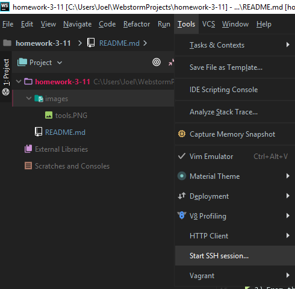

# Lilia B, Priyankitha P, Joel R
# IS117 | Homework 3/11/19 - 4/8/19
# Tutorials
- [Link to Advanced Linux Tutorial](https://docs.google.com/document/d/1HqfuoZZUpkkfZfEORMPhy85m4lMg6fsXuKFUoKfzLug/edit?usp=sharing)
- [Link to Advanced Tutorial on How the Internet Works](https://docs.google.com/document/d/1J2VclpqQwtyaQfhaAS1SwUPiFnyBSM6sOj-R_JMEkuI/edit?usp=sharing)
## How to access NJIT's AFS Directory from WebStorm

**If you are NOT on the NJIT network. You must follow these steps or this process will not work.**
- [x] Check your local internet settings to make sure you are NOT on NJITSecure.
- [x] Visit https://ist.njit.edu/vpn/ and download Cisco AnyConnect VPN for your particular OS.
- [x] Once the program has been installed, use vpn.njit.edu address to connect to the network.
- [x] Upon entering the address, you will need to enter your NJIT login credentials to access the NJIT network 

## Once you've connected to the NJIT network

1 ) In WebStorm go to the Tools section on the top left.

2 ) From the tools menu, go to **"Start SSH Session"**.

3 ) Once you see the login sub menu, enter in the listed host address in the port number. From there log in with your UCID.

4 ) Enter in the highlighted text in yellow to change your directory to your public html folder.

5 ) Once you're in your public directory, use the next highlighted command to see what is currently stored in your public html directory.

# Linux Commands

- ls: directory listing
- ls -a: formatted listing with all file and folder extensions 
- cd: change current working directory
- pwd: show current directory
- mkdir: create a directory 
- rm: delete/remove command 
- rm -r dir: delete directory dir
- rm -f file: force remove file
- rm -rf dir: force remove directory dir
- cp file1 file2: copy file1 to file2
- cp -r dir1 dir2: copy dir1 to dir2
- mv file1 file2: rename or move file1 to file2
- touch file: create or update file
- man: shows the manual for a particular command
- chmod: changes the file permissions
- chown: changes the ownership 
- vi: initialize linux embedded text editor
- exit: closes out of current session

# How the Internet Works

In order to access a web page, your modem/ router will send a request to a DNS server provided by your internet service provider.
 From there the DNS server will direct you to an online directory of places as to where the current IP address you are looking for. After the DNS server has reached the appropriate place, it will contact the web server of where you are looking towards, and redirect your traffic.
 The web server will then send you a return packet of data, of which will is coming directly from a database, thus allowing you to see a displayed web page.

# How HTTP Works

- Browser sends request for a file via HTTP. The web server searches for file and then sends back a response to the browser with said file. 

# How Static and Dynamic Sites Work

- Static: "Served as is" 

-Dynamic: Requires extra software to create and updates files before sending them to a browser. 